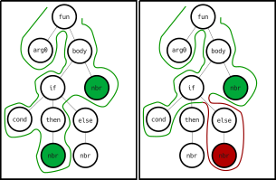
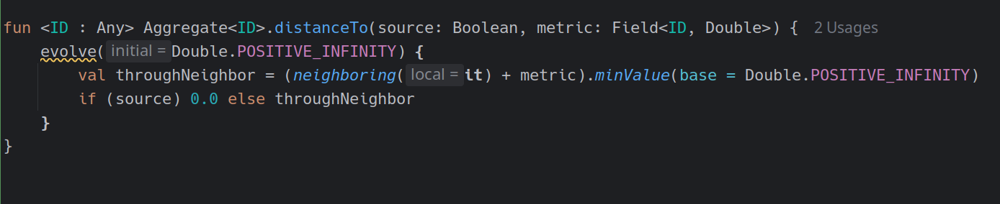

+++

title = "Collektive: Aggregate programming in Kotlin Multiplatform"
description = "Collektive: Aggregate programming in Kotlin Multiplatform"
outputs = ["Reveal"]
aliases = [
    "/progmob/"
]

+++

# Collektive: Aggregate programming in Kotlin Multiplatform

### [Danilo Pianini --- danilo.pianini@unibo.it](mailto:danilo.pianini@unibo.it)

#### Seminar in "Programmazione di Sistemi Mobile" @ Università di Torino

---

# Introduction

---

## Target systems

{}{}

{}{}

* *Networked* systems
* *Heterogeneous* devices
* *Unreliable communication*
* No topology assumptions
  * Usually, the worst case is a *mesh-like topology* with *no clear coordinator*
  * the topology *changes dynamically*
* Devices are possibly *situated*
* Possibly multiple network technologies to be used opportunistically
  * (e.g., bluetooth, wifi, 5g, etc.)
  
{}{}

---


<video width="120%" height="120%" autoplay controls loop><source data-src="https://danysk.github.io/Slides-2019-OYM/video/stampede.mp4" type="video/webm" /></video>

---

## Self-organising systems

One way to tackle these challenges is through systems that *self-organise*.

* *Self-organisation* is a process in which a system spontaneously organizes itself into a structured state without external control.
* It is a **bottom-up** process, where local interactions between components lead to the **emergence** of global patterns or structures.
* Self-organisation is often observed in *natural systems*, such as biological organisms, ecosystems, and social systems.
* It can also be applied to artificial systems, such as robotics, distributed computing, and complex networks.

---

<div id="div1" style="width: 720px; float: left; overflow: hidden;">
  
</div>
<div id="div2" style="width: 720px; float: left; overflow: hidden;">
  
</div>
<div id="div3" style="width: 720px; float: left; overflow: hidden;">
  
</div>
<div id="div4" style="width: 720px; float: left; overflow: hidden;">
  
</div>

---

<iframe
width="1920" height="950"
src="https://www.youtube.com/embed/ZHpu7ngQxwE?si=YPGltxUIp5QtcOlV"
autoplay="true"
title="YouTube video player"
frameborder="0"
allow="accelerometer; autoplay; clipboard-write; encrypted-media; gyroscope; picture-in-picture; web-share"
referrerpolicy="strict-origin-when-cross-origin"
allowfullscreen>
</iframe>

---

## Engineering self-organisation

* Self-organisation is **very hard to engineer**
* The system properties are built **bottom-up** from **local interactions**
* Even worse, even when a self-org system has been built and verified,
it is extremely hard to **reuse** it in a different context

### Where is the *engineering*?

There are properties that we cannot renounce:
* *Top-down design*
* *Modularity*
* *Reusability*
* *Composability*
* *Scalability*
* *Maintainability*

---

## Aggregate programming, the idea

We have a tool that is *natively modular* and *natively composable*:
### **functional programming languages**.

What if we find a set of abstractions compatible with *functional programming*
that allow us to build self-organising systems?

### Aggregate programming, originally:

* The computational machine is the entire system
* Data items are a *fields*
    * A map from *devices* to *values*
* Basic operations:
    * evolution in time: `rep`
    * perception of the surroundings (neighboring field): `nbr`
    * distributed branching (domain segmentation): `if`

---

# A brief history of aggregate programming languages

---

## MIT Proto, 2006


The precursor of aggregate programming,
based on the idea of *amorphus computing*.

* Originally developed at the MIT by Jonathan Bachrach and Jake Beal
* C++ with built-in OpenGL visualisation
* LISP-like syntax
* Re-implemented in Javascript as WebProto
* Discontinued in 2016 in favour of Protelis

```lisp
(def gradient (src)
   (letfed ((n infinity (mux src 0 (min-hood (+ (nbr n) (nbr-range))))))
      n))
```

---

## [Protelis, 2015](https://protelis.github.io/)

<video width="1080" height="450" autoplay controls loop><source data-src="https://protelis.github.io/images/mapehd-small-h264.mp4" type="video/webm" /></video>

The first higher-order aggregate programming language.

{}{}

```python
def distanceTo(source) {
  share (distance <- POSITIVE_INFINITY) {
    mux (source) {
      0
    } else {
      foldMin(POSITIVE_INFINITY, distance + self.nbrRange())
    }
  }
}

```

{}{}

* Originally developed at BBN Technologies and the University of Bologna primarily by Danilo Pianini
    * with support from Jake Beal and Mirko Viroli
* Stand-alone, JVM-based, Java-interoperable domain-specific language
    * Based on [Xtext](https://eclipse.dev/Xtext/)
    * *weakly typed*
* Introduces the higher-order field calculus
* Actively maintained, but feature-frozen

{}{}


---

## [ScaFi (Scala Fields), 2016](https://scafi.github.io/)

The first *internal DSL* implementing aggregate programming.


{}{}

```scala
def distanceTo(source: Boolean): Double =
  rep(Double.PositiveInfinity) (d => {
    mux (source) { 0.0 } {
      foldHoodPlus(Double.PositiveInfinity)(Math.min) {
        nbr(d) + nbrRange
      }
    }
  })
```

{}{}

* Originally developed at the University of Bologna by Mirko Viroli and Roberto Casadei
* Internal DSL written in Scala 2
* Strongly typed, uses the Scala 2 type system natively
* JVM and JS versions
* Different semantics: *partial alignment*, *non-reified fields*
* Actively maintained, but feature-frozen (Scafi 3 based on Scala 3 is under development)

{}{}

---

## [FCPP, 2019](https://scafi.github.io/)


The first *native* (C++14) implementation of aggregate programming.

{}{}

```cpp
DEF() double abf(ARGS, bool source) { CODE
  return nbr(CALL, INF, [&] (field<double> d) {
    double v = source ? 0.0 : INF;
    return min_hood(CALL, d + node.nbr_dist(), v);
  });
}
```

{}{}


* Originally developed at the University of Turin by Giorgio Audrito
* Very high performance
* C++14 library
* *Manually aligned* via macros
* Can work on resource-restricted devices

{}{}

---

## What is missing?

| Properties            | Protelis      | ScaFi         | FCPP          |
|-----------------------|---------------|---------------|---------------|
| JVM compatibility     |   |   |  |
| Android compatibility | ~             | ~             |  |
| JS compatibility      |  |   |  |
| Native compatibility  |  |  |   |
| iOS compatibility     |  |  |  |
| Strictly typed        |  |   |   |
| Transparent alignment |   |  |  |
| Complete alignment    |   |  |   |
| Exchange support      | ~             |  |   |
| Reified fields        |   |  |   |

---

## A matter of trade-offs

*Internal* DSLs have several desirable features:

* They are *easier to maintain*, as the syntax, compiler, and tooling are shared with the host language
* They are more *familiar* to mainstream programmers
    * no need to learn an entire new language, it is just a library
* They can use types from the host language

but they also have some critical issues:
* Their *syntax is restricted* to valid fragments in the host language
* Language-level mechanisms, such as **alignment**, may "boil" up to the surface, making the language pleasant
    * and *violating information hiding*

---

## Alignment, in short


structurally-equal programs *can communicate*

---

## Alignment, in short



branching must break alignment

---

## Alignment when programming

* Alignment is a **low-level mechanism** and as such should be **hidden** when writing aggregate code
    * Just as memory references are hidden when you program in Kotlin or Java
* Implementing alignment requires maintaining your own stack, so that when a communication act happens
the information can be associated to the stack frame

Different frameworks make different choices:
* **Protelis** hides alignment under the hood
    * It can do so because it is an *external* DSL whose interpreter has been realized from zero
* **Scafi** makes several compromises to align
    * Fields are *not reified*, namely, operations of fields can be executed in dedicated contexts (`foldHood`)
    but there is no way to have a `Field`-typed object
    * Similar programs that should not align may align in Scafi (*weak alignment*)
    * Functions are aligned via a stack lookup (`aggregate` function), exposing a low-level mechanism and compromising performance
* **FCPP** relies on *C macros* to align
    * Alignment is *not transparent*

---

## Why Collektive


Collekive answers the question:

> what if we modify the host language compiler to align code strongly and transparently?

Collektive used Kotlin to do so as:
1. Kotlin is becoming a reference language for mobile programming (Android is Kotlin-first)
2. Kotlin is modern and supports nice-looking DSLs
3. The Kotlin compiler can be enriched via *plugins*
4. Kotlin is multiplatform, generating bindings for the JVM, native (incl. iOS), JS, and WASM

---

## Collektive goals

| Properties            | Protelis      | ScaFi         | FCPP          | Collektive   |
|-----------------------|---------------|---------------|---------------|--------------|
| JVM compatibility     |   |   |  |  |
| Android compatibility | ~             | ~             |  |  |
| JS compatibility      |  |   |  |  |
| Native compatibility  |  |  |   |  |
| iOS compatibility     |  |  |  |  |
| Strictly typed        |  |   |   |  |
| Transparent alignment |   |  |  |  |
| Complete alignment    |   |  |   |  |
| Exchange support      | ~             |  |   |  |
| Reified fields        |   |  |   |  |


---

# Collektive: how it feels

---

## A few algorithms you have seen in previous classes

### Adaptive Bellman-Ford (hop count)

```kotlin
fun <ID: Any> Aggregate<ID>.distanceTo(source: Boolean) = share(Double.POSITIVE_INFINITY) { distances ->
    val throughNeighbor = distances.minValue(Double.POSITIVE_INFINITY) + 1
    when {
        source -> 0.0
        else -> throughNeighbor
    }
}
```

* what happens if we move `throughNeighbor` inside the `when`?
* what happens if we use `Int`s or `Long`s instead of `Double`s?

### Adaptive Bellman-Ford (with custom metric)

```kotlin
fun <ID: Any> Aggregate<ID>.distanceTo(source: Boolean, metric: Field<ID, Double>) =
    share(Double.POSITIVE_INFINITY) { distances ->
        val throughNeighbor = (distances + metric).minValue(Double.POSITIVE_INFINITY)
        when {
            source -> 0.0
            else -> throughNeighbor
        }
    }
```

---

### Adaptive Channel

#### Broadcast

```kotlin
// Utility class, we can use Kotlin data types freely
data class DistanceValue<T>(val distance: Double, val value: T) : Comparable<DistanceValue<T>> {
    operator fun plus(distance: Double): DistanceValue<T> = DistanceValue(this.distance + distance, value)
    override fun compareTo(other: DistanceValue<T>): Int = distance.compareTo(other.distance)
    override fun toString(): String = "$value@$distance"
}

// Simple broadcast implementation
inline fun <ID: Any, reified T> Aggregate<ID>.broadcast(source: Boolean, value: T): T {
    val top = DistanceValue(infinity, value)
    val myDistanceValue = share(top) { distancesToValues ->
        val closest = distancesToValues.minValue() ?: top
        if (source) DistanceValue(0.0, value) else closest + 1.0
    }
    return myDistanceValue.value
}
```

#### Distance between two sources

```kotlin
fun <ID: Any> Aggregate<ID>.distance(source: Boolean, destination: Boolean, metric: Field<ID, Double>) = broadcast(source, distanceTo(destination, metric))
```

#### Channel

```kotlin
fun <ID: Any> Aggregate<ID>.channel(source: Boolean, destination: Boolean, width: Double, metric: Field<ID, Double>): Boolean =
    distanceTo(source, metric) + distanceTo(destination, metric) < distance(source, destination, metric) + width
```

#### Channel around obstacles

```kotlin
// Short-circuiting boolean operations work as branches!
fun <ID: Any> Aggregate<ID>.channelAroundObstacles(isObstacle: Boolean, source: Boolean, destination: Boolean, width: Double, metric: Field<ID, Double>): Boolean =
    !isObstacle && channel(source, destination, width, metric)
```

---

# Collektive: under the hood

---

## General structure

* **Domain-Specific Language**
    * *Base abstractions*
        * `Field`
        * `Aggregate`
        * `PurelyLocal`
        * `project(Field)`
    * *Core Machinery*
        * Interpreter implementation
        * Network stub
    * Compiled with the **Compiler Plugin** using the **Gradle Plugin**
* **Compiler Plugin**
    * Requires the *Base Abstractions*
* **Gradle Plugin**
    * Applies the **Compiler plugin** to any project
* **Collektivize**
    * A Gradle plugin that generates "fielded" methods automatically
* **Standard Library**
    * Compiled with the **Compiler Plugin** using the **Gradle Plugin**
      * Functions for common operations
      * Uses **Collektivize** to "field" the Kotlin standard library

---

## Domain-specific language

Collektive introduces the following important abstractions:
* `Field`: a view of a value, enclosing is local value and the neighboring values
    * fields can be manipulated using `map` and combined with `alignedMap`
    * fields can be converted into Kotlin `Map`s, using `toMap` or `excludeSelf`
    * fields can be converted to "scalar" values using `fold` and `reduce` operations
* `Aggregate`: the context of aggregate operations. Provides (internally or through extension functions)
    * (*Core operation*) `alignedOn(pivot: Any?, () -> Result): Result`
        * aligns the code on the given pivot and runs the provided operation
    * (*Core operation*) `exchanging(initial: Shared, body: YieldingScope<Field<ID, Shared>, Returned>): Field<ID, Shared>` 
        * generalized form of `exchange` that shares a value and can return arbitrary values
        * all other operators except `alignedOn` could be rewritten in terms of `exchanging`, but it would be inefficient
    * `exchange(initial: Shared, body: (Field<ID, Shared>) -> Field<ID, Shared>): Field<ID, Shared>`
        * `exchange` shares a value, computes over the neighborhood view of such value,
          and returns a `Field` whose contents are sent back to every neighbor
    * (*Core operation*) `neighboring(local: Shared): Field<ID, Shared>`
        * Provided a value, builds the neighboring view of such value
    * `mapNeighborhood(local: (ID) -> T): Field<ID, T>`
        * Maps every surrounding device, provided its identifier, to a value
    * `share(initial: Shared, body: (Field<ID, Shared>) -> Shared): Shared`
        * simplified version of `exchange` that sends the same value to all neighbors
    * `sharing(initial: Shared, body: YieldingScope<Field<ID, Shared>, Returned>) -> YieldingResult<Shared, Returned>): Returned`
        * generalized version of `share` that can return arbitrary values
    * `evolve(initial: Stored, transform: (Stored) -> Stored): Stored`
        * evolves a value in time, starting from `initial` and computing `transform` at each round
    * (*Core operation*) `evolving(initial: Stored, transform: YieldingScope<Stored, Returned>): Returned`
        * generalized version of `evolve`, returning a `Result`

---

## Domain-specific language

Collektive is designed for the aggregate code to meld into Kotlin natively.
Names have been selected favoring a Kotlin-friendly syntax instead of the literature terms.

| **Literature**   | **Collektive** |
|------------------|----------------|
| `rep`            | `evolve`       |
| `nbr`            | `neighboring`  |
| `share`          | `share`        |
| `xc`             | `exchange`     |

All computations use Kotlin's native types.
* With one caveat: types used in aggregate operations must be `@Serializable`
    * Under the hood, Collektive uses `kotlinx.serialization` to serialize the data

---

## Domain-specific language

### Aggregate branching

There is a missing item in the previous table:

| **Literature** | **Collektive** |
|----------------|----------------|
| `rep`          | `evolve`       |
| `nbr`          | `neighboring`  |
| `share`        | `share`        |
| `xc`           | `exchange`     |
| `if`           | ????           |

Branching in aggregate programming is *domain segmentation*: operations inside a branch are *aligned*
only with the devices that are in the same branch.
* Special problem: fields created *outside* of the branch need **projection**!

```kotlin
// Device with ID 0
fun Aggregate<Int>.myAlignmentTest(): Unit {
    val myField = mapNeighborhood { 1 }
    println(myField) // φ(localId = 0, localValue = 1), neighbors = { 1 -> 1, 2 -> 1, 3 -> 1 }
    when (localId % 2) {
        1 -> println(myField) // Branch not taken
        else -> {
            println(mapNeighborhood { 2 }) // φ(localId = 0, localValue = 2), neighbors = { 2 -> 2 }
            println(myField) // φ(localId = 0, localValue = 1), neighbors = { 2 -> 1 }
        }
    }
}
```

---

## Domain-specific language

### The problem with a "plain" DSL

If we were okay with dealing with alignment manually, we could have used a "plain" DSL.

This is what a Bellman-Ford gradient would have looked like:

```kotlin
fun <ID: Any> Aggregate<ID>.distanceTo(source: Boolean, metric: Field<ID, Double>) =
    alignedOn("Aggregate.distanceTo(Boolean)") { // We need to manually align to avoid clashing with other functions with a similar structure
        share(Double.POSITIVE_INFINITY) { distances ->
            alignedOn("share(Boolean)") { // We need to manually align again
                val actualMetrics = project(metric) // The field comes from another context, hence needs projection
                val throughNeighbor = distances.alignedMapValues(actualMetrics, Double::plus)
                when {
                    source -> alignedOn(true) { 0.0 }
                    else -> alignedOn(false) { throughNeighbor } // We cannot run the computation here or the source will never send data!
                }
            }
    }
}
```

Performing alignment and projection manually is akin to managing memory manually in pure C:
exposes a *low-level mechanism* and is *very error-prone*.

* **Alternative**: never reify fields, create contexts in which operations are aligned (Scafi2)
* **Observation**: alignment and projections can be *automatically inferred* from the code structure!

---

## Reducing boilerplate through a compiler plugin

### Kotlin: compiler plugins

The Kotlin compiler is designed to be extended via *compiler plugins*.
* Compiler plugins are written in Kotlin and can be used to manipulate the Abstract Syntax Tree (AST) of a program.
* Changes to the AST can alter the behavior or generate code at compile time.
* The compiler supports *frontend* plugins for error and warning detection and *backend* plugins for code generation.
* Rough process:
    * Kotlin code $\Rightarrow$ compiler frontend
    $\Rightarrow$ Intermediate Representation (IR)
    $\Rightarrow$ compiler backend
    $\Rightarrow$ Modified IR
    $\Rightarrow$ Lowering
    $\Rightarrow$ Bytecode, JavaScript, Klib, LLVM IR

#### Notable examples:
* **KotlinX serialization**
    * KotlinX serialization is a library for serializing and deserializing Kotlin objects.
    * Annotating a class with `@Serializable` generates a serializer for that class under the hood.
    * Methods `serialize` and `deserialize` are generated at compile time, and appear in the IDE
    * Collektive uses this library and plugin to deal with serialization!
* **Power assert**
    * Power assert is a library for generating detailed error messages for assertions.
    * In case of failure, show with detail what went wrong and where, printing the values of all variables involved in the assertion.

---

## Reducing boilerplate through a compiler plugin

The compiler plugin automatically injects calls to the alignment and projection functions where needed,
so that the designer can write in "normal Kotlin", letting the magic happen in the background:

### Complete and transparent alignment via compiler plugin

```kotlin
fun <ID: Any> Aggregate<ID>.distanceTo(source: Boolean, metric: Field<ID, Double>) =
    share(Double.POSITIVE_INFINITY) { distances ->
        val throughNeighbor = distances.alignedMapValues(metric, Double::plus)
        if (source) 0.0 else throughNeighbor
    }
}
```
---

## Reducing boilerplate through a compiler plugin

### Bonus: static analyzer via frontend compiler plugin

We can write our compiler plugin to
*statically analyze* the code and    provide hints. For instance, consider:

```kotlin
fun <ID : Any> Aggregate<ID>.distanceTo(source: Boolean, metric: Field<ID, Double>) =
    evolve(Double.POSITIVE_INFINITY) {
        val throughNeighbor = (neighboring(it) + metric).minValue(base = Double.POSITIVE_INFINITY)
        if (source) 0.0 else throughNeighbor
    }
```

* It is a valid but *inefficient* implementation of Bellman-Ford (can you tell why?)
* The compiler plugin can *detect the suboptimal pattern* and provide hints:




---

## Applying the compiler plugin

Kotlin is typically compiled with [Gradle](https://gradle.org/), a build system that supports Kotlin natively.

The Collektive Kotlin compiler plugin needs to needs to get applied to the Kotlin compilation process for aggregate code to be generated.

The standard way is to build a Gradle plugin that under the hood applies the Kotlin compiler plugin.

Declaring the plugin in the `plugins` block applies Collektive to the project:

```kotlin
plugins {
    kotlin("jvm") // Or kotlin("multiplatform")
    id("it.unibo.collektive.collektive-plugin") version "<collektive version>"
}
```

---

## Importing the DSL

Once the plugin is applied, we need to import the Collektive DSL to write aggregate code.

```kotlin
dependencies {
    implementation("it.unibo.collektive:collektive-dsl:<collektive version>")
}
```

In multiplatform projects:

```kotlin
kotlin {
    sourceSets {
        val commonMain by getting {
            dependencies {
                implementation("it.unibo.collektive:collektive-dsl:<collektive version>")
            }
        }
    }
}
```

You are ready! Code using Aggregate contexts will get aligned and projected automatically by the compiler plugin.

---

## Standard library

The DSL module contains the bare minimum to write aggregate code.

When creating richer applications, a standard library is needed to provide common operations.

The standard library in collektive is built on top of the DSL module and provides:
* functions to reduce fields to values
* functions to combine fields with other fields or scalars
* functions to propagate information
* functions to accumulate information
* functions to break the network symmetry (e.g., performing leader election)

The standard library can be imported in the same way as the DSL module:

```kotlin
dependencies {
    implementation("it.unibo.collektive:collektive-dsl:<collektive version>")
    implementation("it.unibo.collektive:collektive-stdlib:<collektive version>")
}
```

In multiplatform projects:

```kotlin
kotlin {
    sourceSets {
        val commonMain by getting {
            dependencies {
                implementation("it.unibo.collektive:collektive-dsl:<collektive version>")
                implementation("it.unibo.collektive:collektive-stdlib:<collektive version>")
            }
        }
    }
}
```
---

## Collektivize


Collektivize (logo is temporary) is a Gradle plugin that *generates "fielded" methods* automatically.

When using aggregate programming,
we would like to manipulate fields and other data structures as if they were "scalars".

```kotlin
val x: Field<*, Double> = TODO()
val y: Field<*, Double> = TODO()
x.alignedMapValues(y) { a, b -> a + b } // Verbose!
x + y // Shorter and more readable!
x.mapValues { it * 3 } // Verbose!
x * 3 // Shorter and more readable!
neighboring(File(TODO()).readText()).map { it.lines().first() } // Verbose!
neighboring(File(TODO()).readText()).first()
```

Collektivize runs through existing Kotlin code and generates the "fielded" methods automatically.
The project is still experimental, but we currently use it to generate fielded methods for primitives.

---

# Collektive: prototypation

---

## We need simulation

When developing classic software systems, we use tests and debuggers to guide us through the development process
and to verify the correctness of our code.

Typically:
1. Define the abstractions
2. Prepare the test plan (assuming *Test Driven Development--TDD*)
3. Design & Implement

* When writing aggregate code, testing means *simulating* the system.
    * (well, technically, also testing non-aggregate code requires simulation, but the simulator is the PC in which the code runs)
* Running on the local device alone is a *trivial case* that won't intercept most of the issues that may arise
    when running on a real network.

### Simulation in the aggregate software development process

Simulation is a fundamental part of the aggregate software development process, and it is used in several ways:
* When **building a prototype**, to quickly assess the collektive behavior of a network
* When **testing** the code, and especially in *regression tests*, to verify that the code works as expected
* When **debugging**, to replicate the behavior of a system across multiple runs
* When **profiling** the code, to understand the performance of the system


---

## Simulators for aggregate programming

There are two macro-categories of simulators for aggregate programming:

* **Internal simulators**: 
    * The simulator is bundled with the aggregate programming language distribution
    * *Pro*: dedicated simulator
    * *Pro*: optimizable and generally high-performing
    * **Con**: not portable across different implementations of the field calculus
    * **Con**: high maintenance cost
    * **Con**: generally feature-limited (a consequence of the previous point)
* **External simulators**: 
    * The simulator is a separate software that can run aggregate code
    * *Pro*: separation between the tools, hence only the "glue" connecting the tools needs to be maintained
    * *Pro*: potentially portable to multiple implementations of the field calculus
    * *Pro*: typically feature-rich
    * **Con**: non-dedicated, so some features may be tricky to implement
    * **Con**: general-purpose: some optimizations may not be possible

Often, languages have both, with the internal simulator often used for testing and, at most, prototypation.

---

## Simulators for aggregate programming
### Examples

* **MIT Proto**: built-in internal simulator only
* **Protelis**: Uses [Alchemist](https://alchemistsimulator.github.io/) both for testing (using an old version) and for prototypation (using the latest version)
* **ScaFi**: dedicated Scala simulator for testing and for the web version, integration with [Alchemist](https://alchemistsimulator.github.io/) for prototypation and debugging
* **FCPP**: internal simulator for testing and prototypation, integration with [Gazebo](http://gazebosim.org/) for robotics scenarios
* **Collektive**: minimal internal simulator for internal testing only, integration with [Alchemist](https://alchemistsimulator.github.io/) for prototypation and debugging

---

## Simulators for aggregate programming
### [Alchemist](https://alchemistsimulator.github.io/)

<video loop="" playsinline="" autoplay="" muted="" style="max-width: 100%; display: inline-block; ">
  <source src="https://alchemistsimulator.github.io/home-animation.mp4" type="video/mp4">
  If your browser supported the video tag, there would be a nice video.
</video>

Alchemist is a general-purpose simulator for networked systems.
* Relatively simple environment with nodes and links
* Supports maps and floor plans (in image form)
* Support for simulating networks of tuple spaces (its initial goal in 2011)
* Support for biological multi-cellular simulations (cellular sizes, membranes, molecular channels...)
* Support for *Protelis* and *ScaFi*
* *Collektive* features an integration that will be moved to Alchemist once stable

---

## Simulators for aggregate programming

### How to be a good engineer

#### *The aggregate code **must never** reference entities of the simulator*
 
* Simulators run a *model* of the world, and often expose *shortcuts* that are impossible in real life.
* Assumptions from the simulator may not hold in real life
* We don't want an entire simulator to get embedded with our program
    * It is like having JUnit or Kotlin.test or Kotest embedded in our application

#### Suggestion
* *Write aggregate code in isolation* (ideally, in a module which does not import the simulator)
* Create a small piece of *glue code* that links the simulator to your aggregate code
* Run the problem with the simulator *emulating reality*

Your code will be portable across simulators and real-world devices with no changes!

---

## A playground 

A playground has been prepared at https://github.com/DanySK/collektive-exercises. It includes:
* a preconfigured build importing Alchemist and Collektive
    * the collektive gradle plugin is already applied
* a few examples that work in simulation

### Structure

Two files in the `src/main/kotlin` folder in the `collektive.exercises` package:
* `Playground.kt`
    * Contains functions and code that should not depend on the simulator
* `Entrypoint.kt`
    * Binds the simulator to the aggregate code

We can play with it!
* let's try the adaptive Bellman-Ford algorithm
* let's experiment the raising value problem
* let's try the library gradient
* let's build a channel

---

## Advanced examples

### Multi-Robot Task Assignment

* https://github.com/angelacorte/experiments-2025-acsos-robots
* run with `MAX_SEEDS=1 ./gradlew runAllGraphic`

### Cluster-based multi hop data transmission in maritime environments 
 
* TODO!
* run with `TODO`

---

# Collektive on real world devices

---

* Network model
* Android example

---

# Collektive: Aggregate programming in Kotlin Multiplatform

### [Danilo Pianini --- danilo.pianini@unibo.it](mailto:danilo.pianini@unibo.it)

#### Seminar in "Programmazione di Sistemi Mobile" @ Università di Torino

[start over](#0)

---