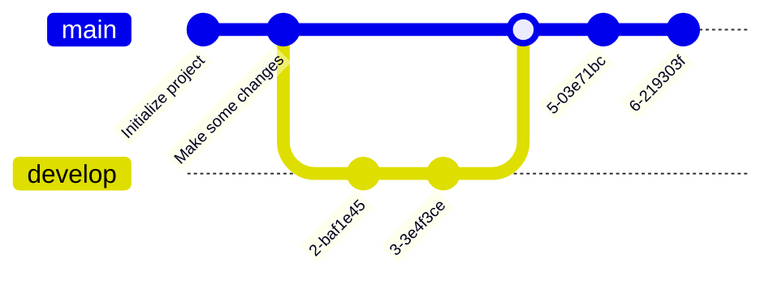

+++

title = "Guide for writing markdown slides"
description = "A Hugo theme for creating Reveal.js presentations"
outputs = ["Reveal"]
aliases = [
    "/progmob/"
]

+++

# Collektive: Aggregate programming in Kotlin Multiplatform

### [Danilo Pianini --- danilo.pianini@unibo.it](mailto:danilo.pianini@unibo.it)

#### Seminar in "Programmazione di Sistemi Mobile" @ Università di Torino

---

# Introduction

---

## Target systems

{}{}

{}{}

* *Networked* systems
* *Heterogeneous* devices
* *Unreliable communication*
* No topology assumptions
  * Usually, the worst case is a *mesh-like topology* with *no clear coordinator*
  * the topology *changes dynamically*
* Devices are possibly *situated*
* Possibly multiple network technologies to be used opportunistically
  * (e.g., bluetooth, wifi, 5g, etc.)
  
{}{}

---


<video width="120%" height="120%" autoplay controls loop><source data-src="https://danysk.github.io/Slides-2019-OYM/video/stampede.mp4" type="video/webm" /></video>

---

## Self-organising systems

One way to tackle these challenges is through systems that *self-organise*.

* *Self-organisation* is a process in which a system spontaneously organizes itself into a structured state without external control.
* It is a **bottom-up** process, where local interactions between components lead to the **emergence** of global patterns or structures.
* Self-organisation is often observed in *natural systems*, such as biological organisms, ecosystems, and social systems.
* It can also be applied to artificial systems, such as robotics, distributed computing, and complex networks.

---

<div id="div1" style="width: 720px; float: left; overflow: hidden;">
  
</div>
<div id="div2" style="width: 720px; float: left; overflow: hidden;">
  
</div>
<div id="div3" style="width: 720px; float: left; overflow: hidden;">
  
</div>
<div id="div4" style="width: 720px; float: left; overflow: hidden;">
  
</div>

---

<iframe
width="1920" height="950"
src="https://www.youtube.com/embed/ZHpu7ngQxwE?si=YPGltxUIp5QtcOlV"
autoplay="true"
title="YouTube video player"
frameborder="0"
allow="accelerometer; autoplay; clipboard-write; encrypted-media; gyroscope; picture-in-picture; web-share"
referrerpolicy="strict-origin-when-cross-origin"
allowfullscreen>
</iframe>

---

## Engineering self-organisation

* Self-organisation is **very hard to engineer**
* The system properties are built **bottom-up** from **local interactions**
* Even worse, even when a self-org system has been built and verified,
it is extremely hard to **reuse** it in a different context

### Where is the *engineering*?

There are properties that we cannot renounce:
* *Top-down design*
* *Modularity*
* *Reusability*
* *Composability*
* *Scalability*
* *Maintainability*

---

## Aggregate programming, the idea

We have a tool that is *natively modular* and *natively composable*:
### **functional programming languages**.

What if we find a set of abstractions compatible with *functional programming*
that allow us to build self-organising systems?

### Aggregate programming, originally:

* The computational machine is the entire system
* Data items are a *fields*
    * A map from *devices* to *values*
* Basic operations:
    * evolution in time: `rep`
    * perception of the surroundings (neighboring field): `nbr`
    * distributed branching (domain segmentation): `if`

---

# A brief history of aggregate programming languages

---

## MIT Proto, 2006


The precursor of aggregate programming,
based on the idea of *amorphus computing*.

* Originally developed at the MIT by Jonathan Bachrach and Jake Beal
* C++ with built-in OpenGL visualisation
* LISP-like syntax
* Re-implemented in Javascript as WebProto
* Discontinued in 2016 in favour of Protelis

```lisp
(def gradient (src)
   (letfed ((n infinity (mux src 0 (min-hood (+ (nbr n) (nbr-range))))))
      n))
```

---

## [Protelis, 2015](https://protelis.github.io/)

<video width="1080" height="450" autoplay controls loop><source data-src="https://protelis.github.io/images/mapehd-small-h264.mp4" type="video/webm" /></video>

The first higher-order aggregate programming language.

{}{}

```python
def distanceTo(source) {
  share (distance <- POSITIVE_INFINITY) {
    mux (source) {
      0
    } else {
      foldMin(POSITIVE_INFINITY, distance + self.nbrRange())
    }
  }
}

```

{}{}

* Originally developed at BBN Technologies and the University of Bologna primarily by Danilo Pianini
    * with support from Jake Beal and Mirko Viroli
* Stand-alone, JVM-based, Java-interoperable domain-specific language
    * Based on [Xtext](https://eclipse.dev/Xtext/)
    * *weakly typed*
* Introduces the higher-order field calculus
* Actively maintained, but feature-frozen

{}{}


---

## [ScaFi (Scala Fields), 2016](https://scafi.github.io/)

The first *internal DSL* implementing aggregate programming.


{}{}

```scala
def distanceTo(source: Boolean): Double =
  rep(Double.PositiveInfinity) (d => {
    mux (source) { 0.0 } {
      foldHoodPlus(Double.PositiveInfinity)(Math.min) {
        nbr(d) + nbrRange
      }
    }
  })
```

{}{}

* Originally developed at the University of Bologna by Mirko Viroli and Roberto Casadei
* Internal DSL written in Scala 2
* Strongly typed, uses the Scala 2 type system natively
* JVM and JS versions
* Different semantics: *partial alignment*, *non-reified fields*
* Actively maintained, but feature-frozen (Scafi 3 based on Scala 3 is under development)

{}{}

---

## [FCPP, 2019](https://scafi.github.io/)


The first *native* (C++14) implementation of aggregate programming.

{}{}

```cpp
DEF() double abf(ARGS, bool source) { CODE
  return nbr(CALL, INF, [&] (field<double> d) {
    double v = source ? 0.0 : INF;
    return min_hood(CALL, d + node.nbr_dist(), v);
  });
}
```

{}{}


* Originally developed at the University of Turin by Giorgio Audrito
* Very high performance
* C++14 library
* *Manually aligned* via macros
* Can work on resource-restricted devices

{}{}

---

## What is missing?

| Properties            | Protelis      | ScaFi         | FCPP          |
|-----------------------|---------------|---------------|---------------|
| JVM compatibility     |   |   |  |
| Android compatibility | ~             | ~             |  |
| JS compatibility      |  |   |  |
| Native compatibility  |  |  |   |
| iOS compatibility     |  |  |  |
| Strictly typed        |  |   |   |
| Transparent alignment |   |  |  |
| Complete alignment    |   |  |   |
| Exchange support      | ~             |  |   |
| Reified fields        |   |  |   |

---

## A matter of trade-offs

*Internal* DSLs have several desirable features:

* They are *easier to maintain*, as the syntax, compiler, and tooling are shared with the host language
* They are more *familiar* to mainstream programmers
    * no need to learn an entire new language, it is just a library
* They can use types from the host language

but they also have some critical issues:
* Their *syntax is restricted* to valid fragments in the host language
* Language-level mechanisms, such as **alignment**, may "boil" up to the surface, making the language pleasant
    * and *violating information hiding*

---

## Alignment, in short


structurally-equal programs *can communicate*

---

## Alignment, in short


branching must break alignment

---

## Alignment when programming

* Alignment is a **low-level mechanism** and as such should be **hidden** when writing aggregate code
    * Just as memory references are hidden when you program in Kotlin or Java
* Implementing alignment requires maintaining your own stack, so that when a communication act happens
the information can be associated to the stack frame

Different frameworks make different choices:
* **Protelis** hides alignment under the hood
    * It can do so because it is an *external* DSL whose interpreter has been realized from zero
* **Scafi** makes several compromises to align
    * Fields are *not reified*, namely, operations of fields can be executed in dedicated contexts (`foldHood`)
    but there is no way to have a `Field`-typed object
    * Similar programs that should not align may align in Scafi (*weak alignment*)
    * Functions are aligned via a stack lookup (`aggregate` function), exposing a low-level mechanism and compromising performance
* **FCPP** relies on *C macros* to align
    * Alignment is *not transparent*

---

## Why Collektive


Collekive answers the question:

> what if we modify the host language compiler to align code strongly and transparently?

Collektive used Kotlin to do so as:
1. Kotlin is becoming a reference language for mobile programming (Android is Kotlin-first)
2. Kotlin is modern and supports nice-looking DSLs
3. The Kotlin compiler can be enriched via *plugins*
4. Kotlin is multiplatform, generating bindings for the JVM, native (incl. iOS), JS, and WASM

---

## Collektive goals

| Properties            | Protelis      | ScaFi         | FCPP          | Collektive   |
|-----------------------|---------------|---------------|---------------|--------------|
| JVM compatibility     |   |   |  |  |
| Android compatibility | ~             | ~             |  |  |
| JS compatibility      |  |   |  |  |
| Native compatibility  |  |  |   |  |
| iOS compatibility     |  |  |  |  |
| Strictly typed        |  |   |   |  |
| Transparent alignment |   |  |  |  |
| Complete alignment    |   |  |   |  |
| Exchange support      | ~             |  |   |  |
| Reified fields        |   |  |   |  |


---

# Collektive: how it feels

---

## A few algorithms you have seen in previous classes

---

# Collektive: under the hood

* general structure
* dsl
    * usa i tipi di Kotlin + Field, niente di esotico
    * core (esempio gradiente)
    * con operatori (esempio gradiente)
* compiler plugin
* complete transparent alignment via compiler plugin
    * allineamento magico stesso esempio
* bonus: static analyzer
    * mostrare versione rep/nbr che dà warning
* gradle plugin
* collektivize
* standard library

---

# Collektive: prototypation

---

* a simulator is necessary for any non trivial case
* interno / esterno, caso di scafi e FCPP
* collektive al momento può usare Alchemist
* integrazione con simulatori e considerazioni ingegneristiche:
scrivere sempre il software in modo isolato e senza fare riferimento alle astrazioni del simulatore
così che la libreria sia "spostabile" e deployabile
* progetto di esempio col repo di collektive-examples come punto di partenza
* hopcount gradient
* hopcount da libreria
* costruire il canale con la libreria live
* mostrare esempi più avanzati (Gianlu e Marti)

---

# Collektive on real world devices

---

* Network model
* Android example


---

---

# Short guide to Markdown slides

---

# Headers

# H1
## H2
### H3
#### H4

---

# Text

normal text

`inline code`

*italic*

**bold**

**_emphasized_**

*__emphasized alternative__*

~~strikethrough~~

[link](http://www.google.com)

---

# Lists and enums

1. First ordered list item
1. Another item
    * Unordered sub-list.
    * with two items
        * another sublist
            1. With a sub-enum
            1. yay!
1. Actual numbers don't matter, just that it's a number
  1. Ordered sub-list
1. And another item.

---

# Inline images


---

## Fallback to shortcodes for resizing

Autoresize specifying

* `max-w` (percent of parent element width) and/or `max-h` (percent of viewport height) as max sizes , and
* `width` and/or `height` as *exact* sizes (as percent of viewport size)



---

## Multi-column slide

{}{}
Column 1
{}{}
Column 2
{}{}

{}
{}
Larger columns using bootstrap
{}
{}
[Link to bootstrap grid system](https://getbootstrap.com/docs/4.0/layout/grid/)
{}
{}


---

## Tick and Cross

* {} This is something good
* {} This is something bad

---

## Chart.js


{
    type: 'bar',
    data: {
        labels: ['Red', 'Blue', 'Yellow', 'Green', 'Purple', 'Orange'],
        datasets: [{
            label: 'Bar Chart',
            data: [12, 19, 18, 16, 13, 14],
            backgroundColor: [
                'rgba(255, 99, 132, 0.2)',
                'rgba(54, 162, 235, 0.2)',
                'rgba(255, 206, 86, 0.2)',
                'rgba(75, 192, 192, 0.2)',
                'rgba(153, 102, 255, 0.2)',
                'rgba(255, 159, 64, 0.2)'
            ],
            borderColor: [
                'rgba(255, 99, 132, 1)',
                'rgba(54, 162, 235, 1)',
                'rgba(255, 206, 86, 1)',
                'rgba(75, 192, 192, 1)',
                'rgba(153, 102, 255, 1)',
                'rgba(255, 159, 64, 1)'
            ],
            borderWidth: 1
        }]
    },
    options: {
        maintainAspectRatio: false,
        scales: {
            yAxes: [{
                ticks: {
                    beginAtZero: true
                }
            }]
        }
    }
}


---

## FontAwesome

<i class="fa-solid fa-mug-hot"></i>
<i class="fa-solid fa-lemon"></i>
<i class="fa-solid fa-flask"></i>
<i class="fa-solid fa-apple-whole"></i>
<i class="fa-solid fa-bacon"></i>
<i class="fa-solid fa-beer-mug-empty"></i>
<i class="fa-solid fa-pepper-hot"></i>

---

## Bootstrap 1

<div class="card w-100" >
  
  <div class="card-body">
    <h5 class="card-title">Card title</h5>
    <p class="card-text">Some quick example text to build on the card title and make up the bulk of the card's content.</p>
    <a href="#" class="btn btn-primary">Go somewhere</a>
  </div>
</div>

---

## Bootstrap 2

<button type="button" class="btn btn-primary">Primary</button>
<button type="button" class="btn btn-secondary">Secondary</button>
<button type="button" class="btn btn-success">Success</button>
<button type="button" class="btn btn-danger">Danger</button>
<button type="button" class="btn btn-warning">Warning</button>
<button type="button" class="btn btn-info">Info</button>
<button type="button" class="btn btn-light">Light</button>
<button type="button" class="btn btn-dark">Dark</button>

<button type="button" class="btn btn-link">Link</button>

---

## Low res, plain markdown


---

## Hi res, plain markdown


---



# Large images as background
## (May affect printing)

---




# Video background

---

# $$\LaTeX{}$$


Inline equations like $E=mc^2$

$$\frac{n!}{k!(n-k)!} = \binom{n}{k}$$

---

# Code snippets


```kotlin
val x = pippo
```

```go
package main

import "fmt"

func main() {
    fmt.Println("Hello world!")
}
```

---

# Tables

Colons can be used to align columns.

| Tables        | Are           | Cool  |
| ------------- |:-------------:| -----:|
| col 3 is      | right-aligned | $1600 |
| col 2 is      | centered      |   $12 |
| zebra stripes | are neat      |    $1 |

There must be at least 3 dashes separating each header cell.
The outer pipes (|) are optional, and you don't need to make the
raw Markdown line up prettily. You can also use inline Markdown.

---

# Quotes

> Multiple
> lines
> of
> a
> single
> quote
> get
> joined

> Very long one liners of Markdown text automatically get broken into a multiline quotation, which is then rendered in the slides.

---

# Fragments

* 
* 
* 

---

# Stacking images with Fragments
{}
{}
<p class="fragment" data-fragment-index="0">Pippo</p>
<p class="fragment" data-fragment-index="1">Pluto</p>
<p class="fragment" data-fragment-index="2">Paperino</p>
{}

{}
<div class="r-stack">
  
  
  
</div>
{}

{}


---

# Graphs via Gravizo


  digraph G {
    aize ="4,4";
    main [shape=box];
    main -> parse [weight=8];
    parse -> execute;
    main -> init [style=dotted];
    main -> cleanup;
    execute -> { make_string; printf}
    init -> make_string;
    edge [color=red];
    main -> printf [style=bold,label="100 times"];
    make_string [label="make a string"];
    node [shape=box,style=filled,color=".7 .3 1.0"];
    execute -> compare;
  }


---

# Graphs via mermaid.js


---


# Graphs via mermaid.js with options


---
# Graphs via mermaid.js 2


---

# Graphs via mermaid.js 3



---

# Keystrokes

<kbd>Ctrl</kbd> + <kbd>Alt</kbd> + <kbd>Del</kbd>

---

# QR code

{}

---

# Import shared slides

<!-- write-here "shared-slides/devops/devops-intro.md" -->
<!-- end-write -->
